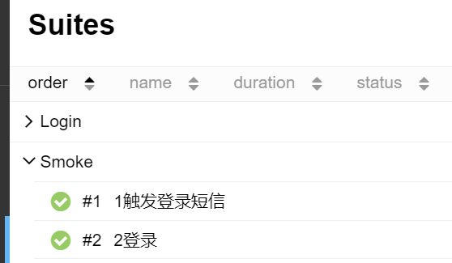

pytest-custom-nodeid: pytest plugin
==============

Support custom grouping. `{group name}` or `{testfile::class}`

Rename testcases name and testcases nodeid, support allure report.

The loadscope load policy based on pytest-xdist is used.

Change testcases nodeid and testcases name encoding to UTF-8 and unicode escape

Format:
  - name: ids
  - nodeid: `group_name::ids`

支持自定义分组 :`{分组名}` 或者 `{文件.py::Class}`

对测试用例名和nodeid进行重命名,方便多个参数化运行同一个测试类使用,也方便基于pytest-xdist的loadscope负载策略使用

对测试用例名和nodeid改为UTF-8编码,使其支持显示中文

格式:
    - 测试名: 进行参数化时的ids参数值
    - nodeid: `首字母大写分组名::ids名`


install
=====

`pip install pytest-custom-nodeid`

Usage
=====

command line:`pytest --rename={on:off}`

tip: It supports running with pytest xdist, and can be concurrent with class according to loadscope policy

小贴士: 支持pytest-xdist插件并发运行,可以按loadscope策略以class为单位进行并发

options:
- rename: Used to open plugin, default "off"

Use `{...}` as a marker custom grouping.

Support "{ filename::classname }" format for multi-level settings

选项:
- rename: 用于开启该插件,默认为"off"关闭

在`parametrize`函数ids中,使用 `{...}` 分组标记

支持"{filename::classname}"这种格式进行多级设置




Demo
=====

```python
import pytest


@pytest.mark.parametrize("group", 
                         ["group_4", "group_5", "group_6"], 
                         ids=["group_4{group_1}", "group_5{group_2}", "group_6{file:class}"])
def test_05(group):
    a = "hello"
    b = "world"
    assert a == b
```

cmd line: `pytest --rename=on -n=auto --dist=loadscope`

Using the loadscope load policy, because there are three groups, it will be divided into three groups to run concurrently

使用了loadscope负载策略,因为存在三个组,所以会分成3组并发运行


